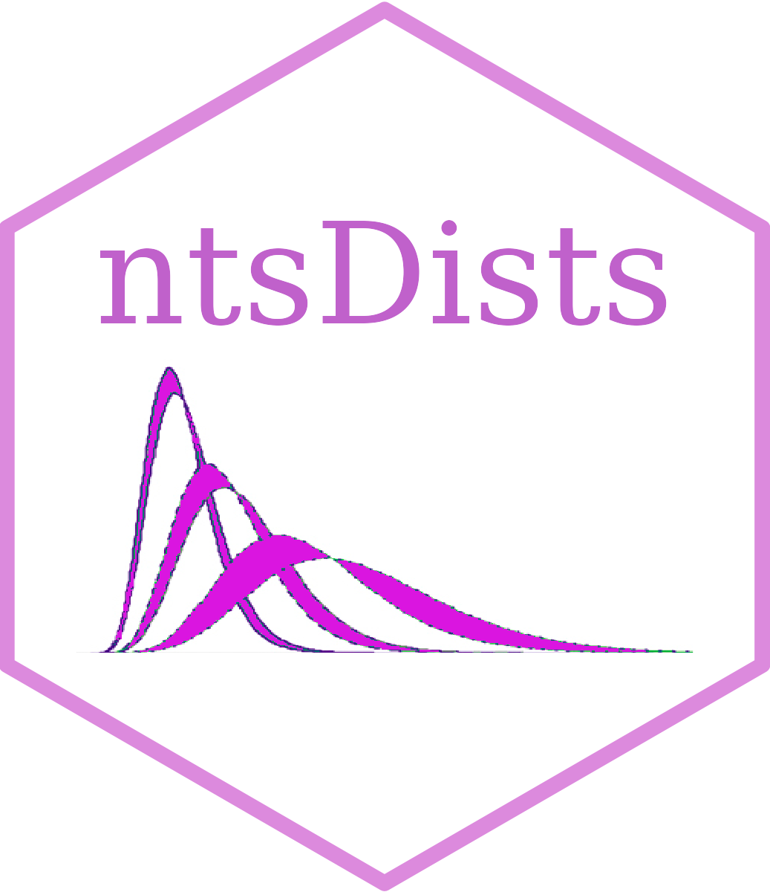

# ntsDists 

[](https://github.com/dmazarei/ntsDists/actions/workflows/R-CMD-check.yaml)
[](https://cran.r-project.org/package=ntsDists)
[](https://cran.r-project.org/package=ntsDists)
[](https://cran.r-project.org/package=ntsDists)
[](https://www.gnu.org/licenses/gpl-3.0.en.html)

The R package *ntsDists* computes some measures of neutrosophic family
of distributions in the area of statistical analysis. More details can
be found Rao et al. (2023).

This work is funded by national funds through the FCT - Fundação para a
Ciência e a Tecnologia, I.P., under the scope of the projects
UIDB/00297/2020 and UIDP/00297/2020 (Center for Mathematics and
Applications)".

## Installation

You can install the **stable** version from
[CRAN](https://cran.r-project.org/package=ntsDists).

``` s
install.packages('ntsDists', dependencies = TRUE)
```

You can install the **development** version from
[Github](https://github.com/dmazarei/ntsDists)

``` s
# install.packages("remotes")
remotes::install_github("dmazarei/ntsDists")
```

## To cite package `ntsDists` in publications use:

Mazarei, D., Norouzirad, M., Roshani, A., Rao, G. S., Esmaeili, F. (2023). *ntsDists:
Neutrosophic distributions*. R package version 2.1.1,
<https://cran.r-project.org/package=ntsDists>.

A BibTeX entry for LaTeX users is

@Manual{ntsDists, title = {ntsDists: Neutrosophic distributions},
author = {Danial Mazarei and Mina Norouzirad and Amin Roshani and Gadde
Srinivasa Rao and Foad Esmaeili}, year = {2023}, note = {R package version 2.1.1}, url =
{<https://cran.r-project.org/package=ntsDists>} }

## License

This package is free and open source software, licensed under GPL-3.
